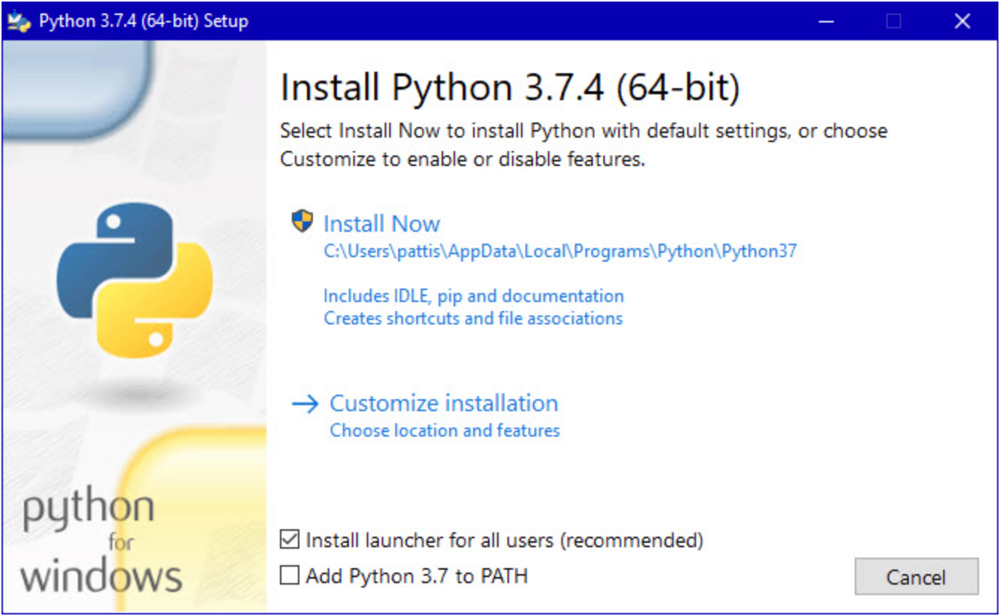

# Django Tutorial

## What is Django
Web applications have become very popular today and as a result frameworks like Django have been created to allow developers to quickly design and develop applications without having to understand lower level concepts of web development such as websockets and HTTP protocols. Frameworks like Django abstract the lower level details and do the heavy lifting so that you don't have to. Think of it as a template that you can customize into anything you want.

## Getting started with Django

### Installing Python

*Note: In the following instructions you will see commands such as `python3 --version`. It is possible that on your machine that same command is equivelent to `python --version`. This is because as I write this I have multiple version of python installed and therefore need to specify which version of Python I would like to use. Do not worry about this now. If `python3` does not work then try `python`.

Likewise with Pip. If `pip3` does not work, try `pip`.*

Go to Python.org and download Python 3.8.2. Scroll to the bottom and select the appropriate installer based on your machine. Assuming you are on a windows machine you will use the `Windows x86-64 executable installer`.

```
https://www.python.org/downloads/release/python-382/
```

1. Select the bottom checkbox in the installer to `add Python to your PATH` in the installer! This will allow your machine to find the installation.<br>
2. Then continue with all default settings by selecting `Install Now`
3. Verify the installation was successful
    - Open Command prompt on your machine
    - type `python3 --version`
   
        ```
        $ python3 --version
        Python 3.8.2
        ```
    - Now type `python3`
    
        ```
        $ python3
        Python 3.8.2 (default, Dec 21 2020, 15:06:04)
        [Clang 12.0.0 (clang-1200.0.32.29)] on darwin
        Type "help", "copyright", "credits" or "license" for more information.
        >>> print("Hello World!")
        Hello World!
        >>>
        ```  

**If you are here then you now have Python installed on your machine and are ready to use it!**

### Installing Pip
Pip is a package manager for Python. Because Python is so popular, there are thousands of tools available for you to use in your project - Django is one of them. To be able to use these tools you will need Pip.
```
curl https://bootstrap.pypa.io/get-pip.py -o get-pip.py
```
Then run the following command.
```
python3 get-pip.py
```

If done properly, you can do the following now.
```
$ pip3 --version
pip 21.0.1 from /usr/local/lib/python3.9/site-packages/pip (python 3.9)
```
