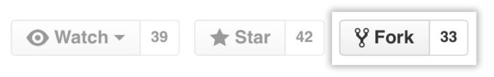
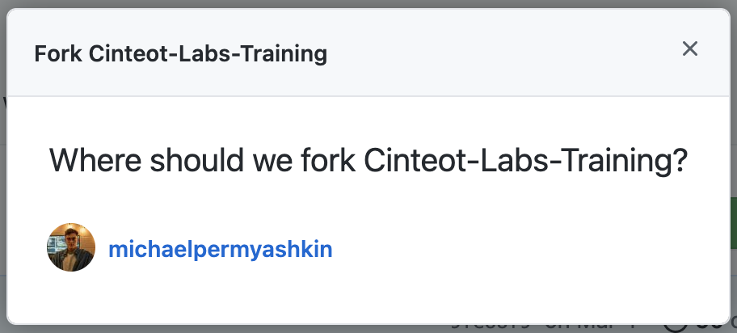

# Cinteot Labs Training Repository
 
### Purpose 

This repository contains a series of tutorials that cover a variety of topics and technologies you may be working on in the lab. In each folder you will find a README markdown file that covers a specific topic. This repository is meant to get your feet wet and write some code. It is not a comprehensive study into these topics by any means and you should explore these, and other, topics on your own.


### Setting Up
1. In the top right of the window click `fork`.


2. A popup will ask you were to put the copy - click on your Github account.


3. Navigate to your Github repositories. You will see `Cinteot Labs Training` is now in your list of personal repositories.

<br>

**_Use your personal copy from this point forward!_**

<br>

### How to move through these tutorials

```
1. Gitting started :: Git
2. Getting started :: Python
2. Django
```

<br>
Some tutorials may reference other programming languages, tools and frameworks. Feel free to explore those as you would like. 
