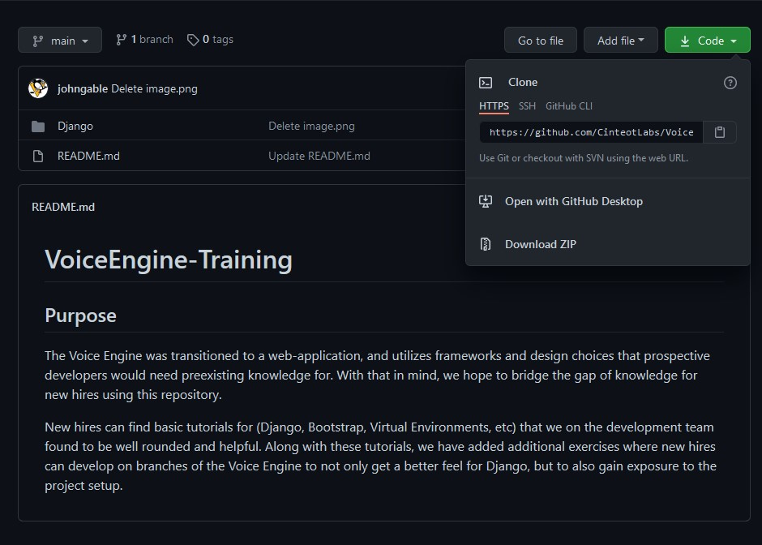
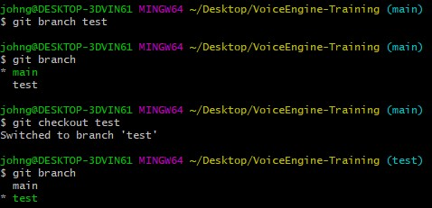
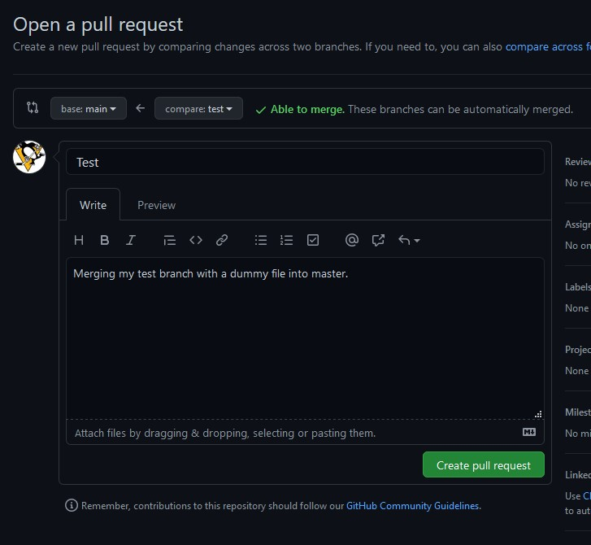

# VoiceEngine-Training

## Purpose 

The Voice Engine was transitioned to a web-application, and utilizes frameworks and design choices that prospective developers would need preexisting knowledge for. With that in mind, we hope to bridge the gap of knowledge for new hires using this repository. 

New hires can find basic tutorials for (Django, Bootstrap, Virtual Environments, etc) that we on the development team found to be well rounded and helpful. Along with these tutorials, we have added additional exercises where new hires can develop on branches of the Voice Engine to not only get a better feel for Django, but to also 
gain exposure to the project setup.

## Gitting Started on Windows

1. The first step for starting the turotial would be to click the link and download Git/Git-Bash. You'll need to gain basic knowledge of git, so this will be helpful.

    https://git-scm.com/downloads

    Git is a useful version control tool used in (hopefully) every development project. The link above installs Git with a GUI called Git-Bash. After installing you should not be able to right-click your desktop and see two options: "Git GUI Here" and "Git Bash Here". Select "Git Bash Here" and a terminal window will pop-up. In this terminal you can now run basic git commands.
    
    
2. The next step is to "clone" this repository. Cloning is simply going to download a copy of this repository locally, but any changes you make on your local copy will be tracked by Git. To clone this repo, click the green Code dropdown (look at the picture if you aren't sure where to find the button). You should see an HTTPS link, copy that link. Now open a Git Bash terminal on your desktop, and type "git clone " with the pasted link and hit enter. You should now see the repository as a folder on your desktop (or where your Git Bash terminal was opened). 
  
  Just to reiterate this is a completely local copy  of the repository and nothing you do will break the code on Github at the moment. Before we go further there's some other Git terminology to know. Git works by using "branches". The main branch is known as "master" or "main". When developing you should NEVER develop on the master branch, instead you make yourself a new branch off of main, develop what you need, and then merge your changes into master. 

3. Let's take a look at your current branch. You can either right click on the new folder and open a new Git Bash or in your existing Git Bash move into the newly cloned repository directory. To move you just have to type `cd VoiceEngine-Training` (or whatever the folder you want to move into is named) into the Git Bash. Now that you are inside of the repo, git commands will become available. To look at your current branch type `git branch`. You should see "main" pop-up. To make a new branch called "test" you can type `git branch test`. You have now made the branch, but you haven't switched to it (you can see by typing `git branch` again). To switch your branch type `git checkout test`.  

4. Great you have your own branch! This step might be a little over your head, but it's important. This branch was made locally and does not currently connect to github at all. We need this branch to exist on github so that you have both a local and global branch. Type `git push --set-upstream origin test`. This will add a branch from master called "test" that you can now push your local "test" branch changes to and other can pull and see. 

5. Next let's make some changes on your branch. Now that you are on your branch, any changes you make will be compared to the original state your branch was in. Open up your repository folder, and make a new txt file name "dummy". To see this change, you can now type into your Git Bash `git status`. Now remember, these changes are local. 
    
    If you want to push your local changes so that everyone can see it, you first need to add your changes. There are two ways to do this: `git add .` and  `git add dummy.txt`. Git adding with `.` will add ALL changes listed from git status to be pushed, but you are also able to add one change at a time by using file names. Use either one and type `git status` again. Git will now say you have a new file being tracked "dummy.txt". 
    
    The next step is "commiting" your changes. Commiting doesn't necessarily make it so other people can see your changes yet, it's more or less a way for you to track and save your local changes. Commiting requires stages to be changes and then you add a summary message of what the stages are. Let's commit, type `git commit -m "Added a dummy.txt file for fun."`. Now you have commited your changes locally. During development commiting often is important because it allows you to revert back to the state your code was in incase you eventually break somethin.
    
    Now that you have commited your changes, you can finally push. Pushing takes your local changes, and places them into the global repository. Doing this allows other to pull your changes, and allows you to merge your changes into master/main branch. To push type `git push`
    
 6. If you go back to the repository on Github, you can navigate through the branch dropdown (see image below), select your "test" branch and you should see the "dummy.txt" file listed in the files now. Let's say you are finished working on your  branch and now you want to add your changes to the master. You should see a notification that "test" had recent changes and a button to "Compare & pull request". Click this button and you will be moved to the pull request view.

    You should see a bar along the top with two drop downs and an arrow between them. Since we  want to merge test into main, ensure that the "base:" has main selected and the "compare:" has your test branch. You also now have the opprotunity to write a description of what merging your branch to main will add. Create your pull request using the button at the bottom right.   
   The final view will appear which is the merging tool. Hopefully git  will show that your branch has no conflicts with master  and you are good to merge. If conflicts do appear do not panic, but try not to fix it yourself. Otherwise click the "Merge pull request" button, and your changes will be in main/master. For the sake of this being a tutorial, when prompted with a "Delete branch" button please click it.
    
7. If you navigate back to the main branch in Github, you should now see your "dummy.txt" file in the repo. If you go back to your Git Bash and switch back to the main branch `git checkout main`, you can also type `ls` to see the files in the directory. If you notice, your dummy.txt file is not there. This is because the change was not merged to your local branch just the github global branch. Let's change that.
 
8. The only step involved is simply typing `git pull` from the main branch in Git Bash. This should download anything you don't already have. Now that you have finished just delete you dummy.txt file from the repo on Github so it doesn't conflict with others.
